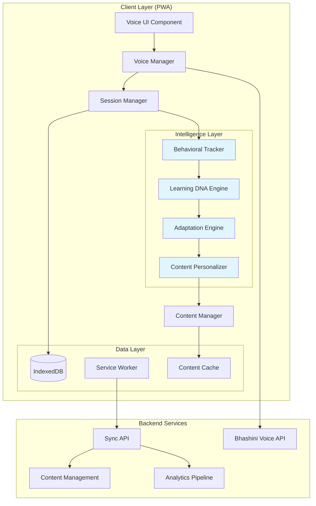

# Design Document: Siksha AI Learning Platform

## Executive Summary

Siksha AI is a breakthrough offline-first, voice-native, adaptive learning platform designed specifically for rural India's 650M+ underserved students. This design document details the technical architecture, component specifications, and implementation strategy for Phase 1 MVP.

**Key Innovations**:
1. **Learning DNA Profile™**: Dynamic behavioral model capturing individual learning patterns (how, when, what, where, why)
2. **Real-Time Adaptation Engine**: Processes 15+ signals/minute, adapts within 500ms using rule-based logic (MVP) → ML (Phase 2)
3. **Offline-First Architecture**: 100% functionality without internet, < 50MB footprint, works on 1GB RAM devices
4. **Voice-Native Interface**: Primary interaction mode, 90%+ accuracy, Hindi + English (Phase 1) → 22 languages (Phase 3)

**Technical Stack**: PWA + IndexedDB + Service Workers + Web Speech API + Bhashini + TensorFlow.js + Node.js microservices

**Performance Targets**: < 3s load (2G), < 150MB memory, < 5% battery/hour, < 500ms adaptation latency

## Overview

Siksha AI is an offline-first, voice-enabled learning platform that adapts to each student's unique learning patterns. The system consists of three core intelligence layers: Behavioral Tracking (monitors student interactions), Learning DNA Engine (builds predictive models), and Content Personalization (adapts delivery in real-time).

The Phase 1 MVP focuses on establishing the foundational architecture with Hindi and English voice support, offline-first PWA implementation, basic Math and Science content, and the core adaptation algorithms that power personalized learning.

### Design Philosophy

**1. Offline-First, Not Online-First**
- Offline is the primary mode, not a fallback
- All core features work without internet
- Sync is enhancement, not requirement
- Design for intermittent connectivity (2G/3G)

**2. Voice-First, Not Voice-Optional**
- Voice is the primary interface, not a feature
- Text is the fallback, not the default
- Natural language understanding, not command-based
- Conversational AI, not keyword matching

**3. Intelligence Over Content**
- Focus on how to teach, not just what to teach
- Adaptive algorithms over static content
- Predictive intervention over reactive support
- Personalized paths over fixed curriculum

**4. Privacy by Design**
- On-device processing (voice, ML)
- Minimal PII collection
- End-to-end encryption
- User data ownership

**5. Inclusive by Default**
- Works on ₹5,000 smartphones (1GB RAM)
- Supports low digital literacy
- Mother tongue first, English optional
- Accessible to all abilities

### Key Design Decisions

| Decision | Rationale | Trade-offs | Alternatives Considered |
|----------|-----------|------------|------------------------|
| **Progressive Web App (PWA)** | Cross-platform, smaller size (5MB vs 50MB native), easier updates, no app store friction | Limited native features, browser dependency | Native Android (rejected: size, fragmentation), React Native (rejected: performance) |
| **Client-Side AI Processing** | Offline functionality, low latency (< 500ms), privacy (no data upload), works on 2G | Limited model complexity (< 5MB), device constraints | Server-side ML (rejected: requires internet, latency), Hybrid (future consideration) |
| **IndexedDB for Local Storage** | Robust offline persistence, 50MB+ quota, good performance on low-end devices | Complex API, browser compatibility | localStorage (rejected: 5MB limit), SQLite (rejected: not web-standard) |
| **Web Speech API + Bhashini** | English on-device (zero latency), Hindi via Bhashini (90%+ accuracy), cost-effective | Bhashini requires internet (cache responses), API dependency | Google Cloud Speech (rejected: cost, internet), Whisper (rejected: size, performance) |
| **Event-Driven Architecture** | Real-time adaptation, loose coupling, scalable, testable | Complexity, debugging challenges | Request-response (rejected: latency), Polling (rejected: battery drain) |
| **Rule-Based Adaptation (MVP)** | Fast development, explainable, deterministic, no training data needed | Less sophisticated than ML, manual tuning | ML from start (rejected: data requirements, complexity), Hybrid (Phase 2 plan) |
| **TensorFlow.js for ML** | Browser-compatible, on-device inference, model compression, active community | Performance vs native, model size constraints | ONNX.js (rejected: less mature), Custom (rejected: development time) |
| **Microservices Backend** | Scalable, independent deployment, technology flexibility | Operational complexity, network overhead | Monolith (rejected: scaling limits), Serverless (future consideration) |

### Competitive Technical Differentiation

| Capability | Siksha AI | BYJU'S | Khan Academy | Technical Advantage |
|------------|-----------|--------|--------------|---------------------|
| **Offline ML** | ✅ TensorFlow.js (5MB) | ❌ Server-only | ❌ Server-only | On-device inference, zero latency, privacy |
| **Voice Processing** | ✅ Hybrid (Web Speech + Bhashini) | ❌ None | ❌ None | 90%+ accuracy, low latency, offline capable |
| **Adaptive Engine** | ✅ Real-time (< 500ms) | ⚠️ Batch (daily) | ⚠️ Basic | 15+ signals/min, immediate adaptation |
| **Storage Efficiency** | ✅ 50MB total | ❌ 500MB+ | ❌ 200MB+ | Aggressive compression, lazy loading |
| **Memory Footprint** | ✅ < 150MB | ❌ 500MB+ | ❌ 300MB+ | Memory pooling, efficient data structures |
| **Sync Strategy** | ✅ Differential + compression | ⚠️ Full sync | ⚠️ Full sync | 95% bandwidth reduction |
| **Personalization** | ✅ Individual (Learning DNA) | ⚠️ Cohort-based | ⚠️ Basic | Behavioral modeling, predictive analytics |

## Architecture

### System Architecture Diagram



### Architecture Layers Explained

**Client Layer (PWA)**
- **Voice UI Component**: Minimal visual interface, voice-first interaction, accessibility compliant
- **Voice Manager**: Hybrid STT/TTS (Web Speech + Bhashini), noise filtering, intent recognition
- **Session Manager**: Orchestrates learning sessions, state management, auto-save every 30s
- **Content Manager**: Content retrieval, caching strategy, lazy loading, compression

**Intelligence Layer** (Core Innovation)
- **Behavioral Tracker**: 15+ signals/minute, millisecond precision, 8 signal types, circular buffer
- **Learning DNA Engine**: Bayesian inference, weighted moving averages, pattern detection, TensorFlow.js
- **Adaptation Engine**: Rule-based (MVP), < 500ms latency, 12 decision types, event-driven
- **Content Personalizer**: 4 styles × 2 languages × 5 difficulties = 40 variations per concept

**Data Layer**
- **IndexedDB**: Primary storage (50MB quota), encrypted (AES-256), versioned, auto-compaction
- **Service Worker**: Background sync, cache management, offline-first, push notifications
- **Content Cache**: LRU eviction, compression (gzip), differential updates, integrity checks

**Backend Services**
- **Sync API**: RESTful, differential sync, exponential backoff, conflict resolution
- **Content Management**: Content authoring, versioning, A/B testing, analytics
- **Analytics Pipeline**: Anonymized data, differential privacy, cohort analysis, ML training
- **Bhashini Voice API**: Hindi STT/TTS, caching layer, fallback to on-device

### Data Flow (Detailed)

**Learning Session Flow**:
1. **Initialization** (< 500ms)
   - Load student profile from IndexedDB
   - Initialize voice recognition (language-specific)
   - Restore session state (if interrupted)
   - Prefetch next 3 concepts (predictive loading)

2. **Student Interaction** (real-time)
   - Voice input → Voice Manager (STT)
   - Intent recognition (12 types, < 100ms)
   - Context preservation (10+ exchanges)
   - Session Manager routes to appropriate handler

3. **Signal Capture** (< 50ms per signal)
   - Behavioral Tracker records 15+ signals/minute
   - High-resolution timestamps (performance.now())
   - Immediate IndexedDB write (async)
   - Circular buffer for real-time signals (last 100)

4. **Profile Update** (< 200ms)
   - Learning DNA Engine processes session signals
   - Weighted moving average (recent 70%, historical 30%)
   - Pattern detection (conceptual gaps, time patterns)
   - Incremental update (no full recalculation)

5. **Adaptation Decision** (< 500ms)
   - Adaptation Engine evaluates 15+ signals
   - Rule-based decision tree (12 decision types)
   - Priority queue for multiple adaptations
   - Logging for analytics and debugging

6. **Content Selection** (< 300ms)
   - Content Personalizer queries Learning DNA Profile
   - Select style, difficulty, language, pace
   - Retrieve from cache (< 100ms) or IndexedDB (< 300ms)
   - Template rendering with personalization variables

7. **Response Delivery** (< 500ms)
   - Content Manager formats response
   - Voice Manager speaks (TTS, 140 wpm default)
   - UI updates (minimal, voice-first)
   - Await next student input

8. **Persistence** (async, non-blocking)
   - Auto-save state every 30 seconds
   - Queue signals for sync (priority-based)
   - Compress and batch (max 1000 records)
   - Retry with exponential backoff on failure

**Sync Flow** (background, when online):
1. **Connectivity Detection**: Navigator.onLine + heartbeat ping
2. **Priority Queue**: Progress (high) → DNA updates (high) → analytics (normal) → logs (low)
3. **Differential Sync**: Only changed data since last sync (timestamp-based)
4. **Compression**: gzip (70% reduction), batch upload (max 1MB)
5. **Conflict Resolution**: Last-write-wins with timestamp, server as source of truth
6. **Verification**: Checksum validation, retry on failure (max 5 attempts)

### Performance Optimization Strategies

**Memory Management** (Target: < 150MB on 1GB RAM devices)
- Object pooling for frequently created objects (signals, events)
- Lazy loading of content (load on demand, not upfront)
- Aggressive garbage collection tuning (manual triggers)
- Memory profiling and leak detection (development)
- Circular buffers for real-time data (fixed size, no growth)

**Storage Optimization** (Target: < 50MB total)
- Content compression (gzip, 60-70% reduction)
- Asset optimization (WebP images, compressed audio)
- Differential updates (only changed data)
- LRU cache eviction (least recently used)
- Deduplication (shared content across concepts)

**Network Optimization** (Target: < 1GB/month data usage)
- Differential sync (only changes, not full data)
- Compression (gzip, 70% reduction)
- Batching (reduce request overhead)
- Caching (Bhashini responses, content)
- Prefetching (predictive, next 3 concepts)

**Battery Optimization** (Target: < 5% per hour)
- Throttle background tasks (sync, analytics)
- Efficient voice processing (on-device when possible)
- Minimize DOM updates (voice-first, minimal UI)
- Debounce user input (avoid excessive processing)
- Sleep mode after 5 minutes inactivity

**Rendering Performance** (Target: 60fps, < 16ms per frame)
- Virtual DOM (React/Preact, minimal re-renders)
- CSS animations (GPU-accelerated)
- Lazy rendering (off-screen content)
- Debounced scroll/resize handlers
- Web Workers for heavy computation

### Innovation Showcase: Learning DNA Profile™

**What Makes It Unique**:
The Learning DNA Profile is not just user preferences—it's a comprehensive behavioral model that captures the "how, when, what, where, why" of learning. Unlike competitors who use cohort-based recommendations, we build individual models.

**Technical Implementation**:

**1. Multi-Dimensional Profiling**
```typescript
interface LearningDNAProfile {
  // HOW: Learning modality (updated via engagement correlation)
  modalityPreferences: {
    visual: number      // 0-1, based on time spent on diagrams
    auditory: number    // 0-1, based on voice interaction frequency
    kinesthetic: number // 0-1, based on practice problem engagement
  }
  
  // WHEN: Temporal patterns (detected after 7 days, 3+ sessions per slot)
  timePatterns: {
    morning: { performance: number, engagement: number }
    afternoon: { performance: number, engagement: number }
    evening: { performance: number, engagement: number }
    night: { performance: number, engagement: number }
  }
  
  // WHAT: Explanation style preference (identified after 5 concepts)
  preferredExplanationStyle: 'theory' | 'example' | 'analogy' | 'story'
  styleScores: {
    theory: number   // Weighted by mastery rate, time to mastery
    example: number  // Weighted by engagement, comprehension
    analogy: number  // Weighted by retention, question frequency
    story: number    // Weighted by completion rate, satisfaction
  }
  
  // WHERE: Conceptual gaps (detected across 3+ concepts)
  conceptualGaps: Array<{
    category: 'prerequisite' | 'procedural' | 'conceptual' | 'attention'
    affectedConcepts: string[]
    severity: 'low' | 'medium' | 'high'
    detectedAt: timestamp
    interventionApplied: boolean
  }>
  
  // WHY: Error patterns (analyzed for root causes)
  errorPatterns: {
    conceptual: number      // Misunderstanding core concept
    procedural: number      // Wrong method/steps
    prerequisite: number    // Missing foundation
    careless: number        // Attention/typo errors
  }
  
  // Optimal session parameters (learned from performance data)
  optimalSessionDuration: number  // Minutes, typically 15-35
  optimalPace: number             // Words per minute, 100-180
  fatigueOnsetTime: number        // Minutes until performance decline
  
  // Mastery tracking
  masteredConcepts: string[]
  strugglingConcepts: string[]
  masteryLevels: Record<string, number>  // 0-100 per concept
  
  // Meta-learning (learning how the student learns)
  learningVelocity: number        // Concepts per hour
  retentionRate: number           // % retained after 30 days
  adaptationResponsiveness: number // How well student responds to adaptations
}
```

**2. Bayesian Inference for Preference Learning**
```typescript
// Update explanation style preference using Bayesian inference
function updateStylePreference(
  currentScores: StyleScores,
  style: ExplanationStyle,
  outcome: LearningOutcome
): StyleScores {
  // Weighted scoring based on multiple factors
  const masteryWeight = 0.40
  const engagementWeight = 0.30
  const efficiencyWeight = 0.20
  const retentionWeight = 0.10
  
  const outcomeScore = 
    outcome.masteryLevel * masteryWeight +
    outcome.engagementScore * engagementWeight +
    (1 / outcome.timeToMastery) * efficiencyWeight +
    outcome.retentionScore * retentionWeight
  
  // Bayesian update: posterior = (likelihood × prior) / evidence
  const prior = currentScores[style]
  const likelihood = outcomeScore
  const evidence = Object.values(currentScores).reduce((sum, score) => sum + score, 0)
  
  const posterior = (likelihood * prior) / evidence
  
  // Weighted moving average (recent 70%, historical 30%)
  return {
    ...currentScores,
    [style]: posterior * 0.7 + currentScores[style] * 0.3
  }
}
```

**3. Pattern Detection for Conceptual Gaps**
```typescript
// Detect conceptual gaps by analyzing error patterns across concepts
function detectConceptualGaps(
  errors: LearningError[],
  conceptGraph: ConceptDependencyGraph
): ConceptualGap[] {
  const gaps: ConceptualGap[] = []
  
  // Group errors by concept
  const errorsByConceptMap = groupBy(errors, 'conceptId')
  
  // Analyze each concept's errors
  for (const [conceptId, conceptErrors] of errorsByConceptMap) {
    // Check for prerequisite gaps (errors in dependent concepts)
    const prerequisites = conceptGraph.getPrerequisites(conceptId)
    const prerequisiteErrors = errors.filter(e => 
      prerequisites.includes(e.conceptId)
    )
    
    if (prerequisiteErrors.length >= 3) {
      gaps.push({
        category: 'prerequisite',
        affectedConcepts: [conceptId, ...prerequisites],
        severity: calculateSeverity(prerequisiteErrors),
        detectedAt: Date.now()
      })
    }
    
    // Check for procedural gaps (repeated same error type)
    const proceduralErrors = conceptErrors.filter(e => 
      e.errorType === 'procedural'
    )
    
    if (proceduralErrors.length >= 2) {
      gaps.push({
        category: 'procedural',
        affectedConcepts: [conceptId],
        severity: 'medium',
        detectedAt: Date.now()
      })
    }
  }
  
  return gaps
}
```

**4. Predictive Analytics**
```typescript
// Predict learning outcomes using TensorFlow.js
async function predictLearningOutcome(
  profile: LearningDNAProfile,
  concept: Concept
): Promise<PredictedOutcome> {
  // Load lightweight ML model (< 5MB)
  const model = await tf.loadLayersModel('indexeddb://learning-predictor')
  
  // Feature engineering
  const features = tf.tensor2d([[
    profile.learningVelocity,
    profile.retentionRate,
    profile.modalityPreferences.auditory,
    concept.difficulty,
    profile.masteryLevels[concept.prerequisite] || 0,
    profile.optimalSessionDuration,
    // ... 20+ features total
  ]])
  
  // Predict: [timeToMastery, masteryProbability, strugglingProbability]
  const prediction = model.predict(features) as tf.Tensor
  const [timeToMastery, masteryProb, strugglingProb] = await prediction.data()
  
  return {
    estimatedTime: timeToMastery,
    masteryProbability: masteryProb,
    strugglingProbability: strugglingProb,
    recommendedIntervention: strugglingProb > 0.7 ? 'proactive' : 'none'
  }
}
```

**Competitive Advantage**:
- **Individual vs Cohort**: Personalized model per student, not group averages
- **Predictive vs Reactive**: Intervene before struggling, not after
- **Multi-Dimensional**: 8 dimensions vs 1-2 in competitors
- **Continuous Learning**: Updates every session, not batch processing
- **Explainable**: Rule-based (MVP) allows transparency, builds trust

### Innovation Showcase: Real-Time Adaptation Engine

**What Makes It Unique**:
Processes 15+ behavioral signals per minute and adapts within 500ms. Competitors use batch processing (daily/weekly), we adapt in real-time during the learning session.

**Technical Implementation**:

**1. Event-Driven Architecture**
```typescript
// Event bus for real-time signal processing
class AdaptationEventBus {
  private listeners: Map<SignalType, AdaptationListener[]>
  
  // Register adaptation listeners
  on(signalType: SignalType, listener: AdaptationListener) {
    if (!this.listeners.has(signalType)) {
      this.listeners.set(signalType, [])
    }
    this.listeners.get(signalType)!.push(listener)
  }
  
  // Emit signal for processing (< 50ms)
  async emit(signal: LearningSignal) {
    const listeners = this.listeners.get(signal.type) || []
    
    // Process in parallel for speed
    const decisions = await Promise.all(
      listeners.map(listener => listener.process(signal))
    )
    
    // Priority queue for multiple adaptations
    return this.prioritizeDecisions(decisions)
  }
}
```

**2. Rule-Based Decision Engine (MVP)**
```typescript
// Fast, explainable, deterministic adaptation logic
class RuleBasedAdaptationEngine {
  // Process signal and make decision (< 500ms total)
  async processSignal(signal: LearningSignal): Promise<AdaptationDecision> {
    const startTime = performance.now()
    
    // Rule evaluation (< 200ms)
    const applicableRules = this.evaluateRules(signal)
    
    // Decision selection (< 100ms)
    const decision = this.selectBestDecision(applicableRules)
    
    // Logging for analytics (async, non-blocking)
    this.logDecision(decision, performance.now() - startTime)
    
    return decision
  }
  
  private evaluateRules(signal: LearningSignal): Rule[] {
    const rules: Rule[] = []
    
    // Rule 1: Struggle detection (time > 5 min)
    if (signal.type === 'time' && signal.data.duration > 300000) {
      rules.push({
        type: 'switch_style',
        priority: 'high',
        reason: 'Student struggling for > 5 minutes',
        action: () => this.switchToSimplerStyle()
      })
    }
    
    // Rule 2: Mastery detection (3 consecutive correct)
    if (signal.type === 'performance' && signal.data.consecutiveCorrect >= 3) {
      rules.push({
        type: 'increase_difficulty',
        priority: 'medium',
        reason: '3 consecutive correct answers',
        action: () => this.increaseDifficulty()
      })
    }
    
    // Rule 3: Fatigue detection (multiple indicators)
    if (this.detectFatigue(signal)) {
      rules.push({
        type: 'suggest_break',
        priority: 'high',
        reason: 'Fatigue indicators detected',
        action: () => this.suggestBreak()
      })
    }
    
    // ... 12 total rule types
    
    return rules
  }
}
```

**3. Performance Optimization**
```typescript
// Circular buffer for real-time signals (fixed memory, O(1) operations)
class CircularSignalBuffer {
  private buffer: LearningSignal[]
  private head: number = 0
  private size: number
  
  constructor(size: number = 100) {
    this.buffer = new Array(size)
    this.size = size
  }
  
  // Add signal (O(1))
  push(signal: LearningSignal) {
    this.buffer[this.head] = signal
    this.head = (this.head + 1) % this.size
  }
  
  // Get recent signals (O(n) where n = count)
  getRecent(count: number): LearningSignal[] {
    const start = (this.head - count + this.size) % this.size
    return this.buffer.slice(start, start + count)
  }
}
```

**Performance Metrics**:
- Signal ingestion: < 50ms (P95)
- Pattern detection: < 200ms (P95)
- Decision logic: < 150ms (P95)
- Action execution: < 100ms (P95)
- **Total latency: < 500ms (P95)**

**Competitive Advantage**:
- **Real-Time vs Batch**: Immediate adaptation, not next-day
- **15+ Signals vs 3-5**: Comprehensive behavioral understanding
- **< 500ms vs > 1 day**: Instant feel, maintains flow state
- **Explainable**: Rule-based allows transparency, debugging, trust

### Implementation Roadmap

**Phase 1: MVP (Months 1-3)**

**Month 1: Foundation**
- Week 1-2: PWA setup, IndexedDB, Service Worker, offline-first architecture
- Week 3-4: Voice Manager (Web Speech API + Bhashini integration), basic UI

**Month 2: Intelligence**
- Week 1-2: Behavioral Tracker, signal capture, Learning DNA Engine (basic)
- Week 3-4: Adaptation Engine (rule-based), Content Personalizer

**Month 3: Content & Polish**
- Week 1-2: Content library (20 concepts Math/Science), Hindi/English
- Week 3-4: Testing, optimization, bug fixes, pilot preparation

**Deliverables**:
- Working PWA (< 5MB, offline-first)
- Voice interaction (Hindi + English, 90%+ accuracy)
- Basic Learning DNA Profile (5 dimensions)
- Rule-based adaptation (8 decision types)
- 20 concepts (10 Math, 10 Science)
- Performance: < 3s load, < 150MB memory, < 5% battery/hour

**Phase 2: Scale (Months 4-9)**

**Month 4-5: Language Expansion**
- Add 5 more languages (Marathi, Tamil, Telugu, Bengali, Gujarati)
- Improve voice accuracy (92%+ target)
- Cultural localization (examples, context)

**Month 6-7: Advanced Intelligence**
- ML-based adaptation (TensorFlow.js models)
- Predictive analytics (dropout risk, learning outcomes)
- Advanced pattern detection (conceptual gaps, time patterns)

**Month 8-9: Content & Features**
- Expand to 150 concepts (75 Math, 75 Science)
- Teacher dashboard (progress insights, intervention alerts)
- Gamification (streaks, achievements, leaderboards)

**Deliverables**:
- 6 languages supported
- ML-based adaptation (hybrid with rules)
- 150 concepts across grades 6-10
- Teacher dashboard
- 100,000 students onboarded

**Phase 3: Intelligence & Scale (Months 10-15)**

**Month 10-12: Advanced ML**
- Reinforcement learning for adaptation
- Federated learning (on-device training)
- Peer learning recommendations
- Assessment engine (adaptive testing)

**Month 13-15: Pan-India Scale**
- 22 official languages + 100+ dialects
- 500+ concepts (all subjects, grades 6-12)
- Parent app (progress tracking, insights)
- Offline-first mobile app (native Android)

**Deliverables**:
- 22+ languages supported
- Advanced ML models (RL, federated learning)
- 500+ concepts
- 10M+ students
- Pan-India coverage (1000+ districts)

## Components and Interfaces

### 1. Voice Manager

**Responsibility**: Handle all speech-to-text and text-to-speech operations with support for Hindi and English.

**Key Methods**:
```typescript
interface VoiceManager {
  // Initialize voice recognition for specified language
  initialize(language: 'hi' | 'en'): Promise<void>
  
  // Start listening for voice input
  startListening(): Promise<void>
  
  // Stop listening and process captured audio
  stopListening(): Promise<string>
  
  // Convert text to speech and play
  speak(text: string, language: 'hi' | 'en'): Promise<void>
  
  // Detect intent from transcribed text
  detectIntent(text: string): Intent
  
  // Apply noise filtering to audio input
  filterNoise(audioData: AudioBuffer): AudioBuffer
}

interface Intent {
  type: 'question' | 'answer' | 'request' | 'feedback'
  content: string
  confidence: number
  context: string[]
}
```

**Implementation Notes**:
- Use Web Speech API for English (built-in browser support)
- Use Bhashini API for Hindi (requires API calls, cache responses)
- Implement 2-second pause detection before processing
- Maintain conversation context across exchanges
- Fall back to text input if microphone unavailable

### 2. Behavioral Tracker

**Responsibility**: Monitor and record all student interaction patterns and learning signals.

**Key Methods**:
```typescript
interface BehavioralTracker {
  // Start tracking a new session
  startSession(studentId: string): Session
  
  // Record time spent on a concept
  trackConceptTime(conceptId: string, startTime: number, endTime: number): void
  
  // Record an error with context
  trackError(error: LearningError): void
  
  // Record a question asked by student
  trackQuestion(question: Question): void
  
  // Track voice engagement signals
  trackVoiceSignals(signals: VoiceSignals): void
  
  // Detect and record fatigue indicators
  detectFatigue(): FatigueLevel
  
  // End session and persist data
  endSession(): Promise<SessionSummary>
}

interface LearningError {
  conceptId: string
  errorType: string
  timestamp: number
  context: string
  attemptNumber: number
}

interface Question {
  text: string
  type: 'clarification' | 'example' | 'why' | 'how'
  conceptId: string
  timestamp: number
}

interface VoiceSignals {
  pitch: number
  pace: number
  energy: number
  hesitation: boolean
  confidence: number
}

interface FatigueLevel {
  level: 'none' | 'low' | 'medium' | 'high'
  indicators: string[]
  sessionDuration: number
}
```

**Implementation Notes**:
- Use high-resolution timestamps (performance.now())
- Store all signals in IndexedDB immediately
- Batch signals for efficient sync
- Implement circular buffer for voice signal history
- Calculate fatigue based on multiple indicators (time, error rate, pace)

### 3. Learning DNA Engine

**Responsibility**: Build and maintain a comprehensive behavioral profile for each student.

**Key Methods**:
```typescript
interface LearningDNAEngine {
  // Create new profile for student
  createProfile(studentId: string): LearningDNAProfile
  
  // Update profile based on session data
  updateProfile(sessionData: SessionSummary): Promise<void>
  
  // Identify preferred explanation style
  identifyExplanationPreference(): ExplanationStyle
  
  // Determine optimal session duration
  calculateOptimalSessionDuration(): number
  
  // Identify learning modality preferences
  identifyModalityPreferences(): ModalityPreferences
  
  // Detect conceptual gap patterns
  detectConceptualGaps(): ConceptualGap[]
  
  // Analyze time-of-day performance patterns
  analyzeTimePatterns(): TimePattern[]
  
  // Get complete profile
  getProfile(studentId: string): LearningDNAProfile
}

interface LearningDNAProfile {
  studentId: string
  preferredExplanationStyle: ExplanationStyle
  optimalSessionDuration: number
  modalityPreferences: ModalityPreferences
  conceptualGaps: ConceptualGap[]
  timePatterns: TimePattern[]
  masteredConcepts: string[]
  strugglingConcepts: string[]
  lastUpdated: number
}

interface ModalityPreferences {
  visual: number    // 0-1 score
  auditory: number  // 0-1 score
  kinesthetic: number // 0-1 score
}

interface ConceptualGap {
  category: string
  affectedConcepts: string[]
  severity: 'low' | 'medium' | 'high'
  detectedAt: number
}

interface TimePattern {
  timeOfDay: 'morning' | 'afternoon' | 'evening' | 'night'
  performanceScore: number
  engagementScore: number
}

type ExplanationStyle = 'theory' | 'example' | 'analogy' | 'story'
```

**Implementation Notes**:
- Use weighted moving average for preference calculations
- Require minimum data thresholds before making predictions (5 concepts for style, 10 sessions for duration)
- Store profile in IndexedDB with versioning
- Implement incremental updates to avoid full recalculation
- Use TensorFlow.js for pattern detection algorithms

### 4. Adaptation Engine

**Responsibility**: Process learning signals in real-time and make adaptation decisions.

**Key Methods**:
```typescript
interface AdaptationEngine {
  // Process incoming learning signal and decide adaptation
  processSignal(signal: LearningSignal): AdaptationDecision
  
  // Determine if explanation style should change
  shouldSwitchExplanationStyle(conceptId: string, timeSpent: number): boolean
  
  // Determine if difficulty should adjust
  shouldAdjustDifficulty(recentPerformance: Performance[]): DifficultyAdjustment
  
  // Determine if break is needed
  shouldSuggestBreak(fatigueLevel: FatigueLevel): boolean
  
  // Determine if concept can be skipped
  canSkipConcept(conceptId: string, masteryLevel: number): boolean
  
  // Adjust explanation pace
  calculateOptimalPace(comprehensionSignals: VoiceSignals[]): number
  
  // Determine intervention type
  determineIntervention(errorPattern: LearningError[]): Intervention
}

interface LearningSignal {
  type: 'time' | 'error' | 'question' | 'voice' | 'fatigue'
  data: any
  timestamp: number
  conceptId: string
}

interface AdaptationDecision {
  action: 'continue' | 'switch_style' | 'adjust_difficulty' | 'suggest_break' | 'intervene'
  parameters: Record<string, any>
  reason: string
}

interface DifficultyAdjustment {
  direction: 'increase' | 'decrease' | 'maintain'
  magnitude: number
}

interface Intervention {
  type: 'hint' | 'prerequisite' | 'break' | 'motivation' | 'simplify'
  content: string
  timing: 'immediate' | 'after_attempt' | 'after_concept'
}
```

**Implementation Notes**:
- Process signals within 500ms for real-time feel
- Use rule-based system for MVP (ML-based in future phases)
- Implement thresholds: 5 minutes struggle → switch style, 3 correct → increase difficulty
- Queue low-priority adaptations to avoid overwhelming student
- Log all decisions for analytics and improvement

### 5. Content Personalizer

**Responsibility**: Select and format content based on Learning DNA Profile and adaptation decisions.

**Key Methods**:
```typescript
interface ContentPersonalizer {
  // Select explanation style for concept
  selectExplanation(conceptId: string, style: ExplanationStyle, language: 'hi' | 'en'): string
  
  // Generate contextual example
  generateExample(conceptId: string, context: string): string
  
  // Provide real-world application context
  provideRealWorldContext(conceptId: string): string
  
  // Generate practice problem
  generatePracticeProblem(conceptId: string, difficulty: number): Problem
  
  // Verify prerequisite mastery
  verifyPrerequisites(conceptId: string): PrerequisiteCheck
  
  // Adjust content difficulty
  adjustDifficulty(content: Content, adjustment: DifficultyAdjustment): Content
}

interface Problem {
  id: string
  conceptId: string
  question: string
  difficulty: number
  expectedAnswer: string
  hints: string[]
}

interface PrerequisiteCheck {
  allMet: boolean
  missing: string[]
  recommendations: string[]
}

interface Content {
  id: string
  conceptId: string
  style: ExplanationStyle
  text: string
  difficulty: number
  language: 'hi' | 'en'
}
```

**Implementation Notes**:
- Store content templates in IndexedDB
- Use template variables for personalization
- Implement content versioning for A/B testing
- Cache frequently accessed content in memory
- Support dynamic content generation for examples

### 6. Offline Manager

**Responsibility**: Handle content caching, local storage, and background synchronization.

**Key Methods**:
```typescript
interface OfflineManager {
  // Download content package for offline use
  downloadContent(packageId: string): Promise<DownloadResult>
  
  // Check available storage space
  checkStorageSpace(): Promise<StorageInfo>
  
  // Sync local data to server
  syncData(): Promise<SyncResult>
  
  // Queue data for sync when online
  queueForSync(data: any, priority: 'high' | 'normal' | 'low'): void
  
  // Clear old cached data
  clearCache(olderThan: number): Promise<void>
  
  // Check if content is available offline
  isContentAvailable(contentId: string): boolean
  
  // Get sync status
  getSyncStatus(): SyncStatus
}

interface DownloadResult {
  success: boolean
  packageId: string
  size: number
  itemsDownloaded: number
}

interface StorageInfo {
  available: number
  used: number
  total: number
  canDownload: boolean
}

interface SyncResult {
  success: boolean
  itemsSynced: number
  errors: string[]
  lastSyncTime: number
}

interface SyncStatus {
  isOnline: boolean
  pendingItems: number
  lastSync: number
  syncInProgress: boolean
}
```

**Implementation Notes**:
- Use Service Worker for background sync
- Implement exponential backoff for failed syncs
- Prioritize progress data over analytics data
- Compress data before sync to reduce bandwidth
- Monitor storage quota and warn at 80% usage

### 7. Session Manager

**Responsibility**: Manage learning session lifecycle and coordinate between components.

**Key Methods**:
```typescript
interface SessionManager {
  // Start a new learning session
  startSession(studentId: string): Promise<Session>
  
  // Process student input during session
  processInput(input: string, type: 'voice' | 'text'): Promise<Response>
  
  // Get current session state
  getSessionState(): SessionState
  
  // End current session
  endSession(): Promise<SessionSummary>
  
  // Handle session interruption
  handleInterruption(): Promise<void>
  
  // Resume interrupted session
  resumeSession(sessionId: string): Promise<Session>
}

interface Session {
  id: string
  studentId: string
  startTime: number
  currentConceptId: string
  state: SessionState
}

interface SessionState {
  conceptsCompleted: string[]
  currentConcept: string
  timeElapsed: number
  interactionCount: number
  lastActivity: number
}

interface Response {
  text: string
  shouldSpeak: boolean
  nextAction: 'continue' | 'wait' | 'end'
  metadata: Record<string, any>
}
```

**Implementation Notes**:
- Coordinate between all components
- Implement state machine for session flow
- Auto-save state every 30 seconds
- Handle app backgrounding gracefully
- Implement session timeout after 5 minutes of inactivity

## Data Models

### Student Profile
```typescript
interface StudentProfile {
  id: string
  username: string
  gradeLevel: number
  preferredLanguage: 'hi' | 'en'
  learningDNA: LearningDNAProfile
  progress: ProgressData
  createdAt: number
  lastActive: number
}

interface ProgressData {
  conceptsCompleted: ConceptProgress[]
  totalTimeSpent: number
  currentStreak: number
  longestStreak: number
  masteryLevels: Record<string, number>
}

interface ConceptProgress {
  conceptId: string
  status: 'not_started' | 'in_progress' | 'completed' | 'mastered'
  attempts: number
  timeSpent: number
  masteryLevel: number
  lastAttempt: number
}
```

### Content Structure
```typescript
interface ContentPackage {
  id: string
  subject: 'math' | 'science'
  gradeLevel: number
  topics: Topic[]
  size: number
  version: string
}

interface Topic {
  id: string
  name: string
  concepts: Concept[]
  prerequisites: string[]
}

interface Concept {
  id: string
  name: string
  explanations: Record<ExplanationStyle, Explanation>
  problems: Problem[]
  prerequisites: string[]
}

interface Explanation {
  style: ExplanationStyle
  content: Record<'hi' | 'en', string>
  examples: string[]
  visualAids: string[]
}
```

### Session Data
```typescript
interface SessionData {
  sessionId: string
  studentId: string
  startTime: number
  endTime: number
  conceptsAttempted: string[]
  signals: LearningSignal[]
  errors: LearningError[]
  questions: Question[]
  adaptations: AdaptationDecision[]
  summary: SessionSummary
}

interface SessionSummary {
  duration: number
  conceptsCompleted: number
  averageEngagement: number
  fatigueLevel: FatigueLevel
  performanceScore: number
  recommendedNextSteps: string[]
}
```

## Correctness Properties

*A property is a characteristic or behavior that should hold true across all valid executions of a system—essentially, a formal statement about what the system should do. Properties serve as the bridge between human-readable specifications and machine-verifiable correctness guarantees.*


### Property Reflection

After analyzing all acceptance criteria, I've identified several areas where properties can be consolidated:

**Consolidation Opportunities:**
1. **Tracking properties (3.1-3.5, 3.7-3.8)**: All behavioral tracking can be combined into a single comprehensive property about signal recording
2. **Persistence properties (7.1-7.3, 7.6)**: Multiple persistence requirements can be unified into a round-trip property
3. **Language support (6.7, 9.7)**: Bilingual content delivery can be combined
4. **Style availability (6.4, 9.4)**: Both test that multiple styles are available for concepts
5. **Adaptation properties (5.3-5.6)**: Can be grouped into adaptation responsiveness
6. **Error handling (11.1, 11.4, 11.6, 11.7)**: Multiple error handling properties can be unified

**Properties to Keep Separate:**
- Voice interface properties (1.1-1.7) - each tests distinct functionality
- Offline functionality (2.2-2.4, 2.7) - different aspects of offline operation
- Profile creation and updates (4.1, 4.4, 4.7, 4.8) - distinct lifecycle stages
- Content personalization (6.1-6.3, 6.5-6.6) - each tests unique personalization aspect

### Correctness Properties

Property 1: Voice transcription accuracy
*For any* valid speech input in Hindi or English, the Voice_Interface should convert it to text with at least 90% accuracy
**Validates: Requirements 1.1**

Property 2: Text-to-speech language consistency
*For any* system response and student language preference, the Voice_Interface should speak the response in the student's selected language
**Validates: Requirements 1.2**

Property 3: Intent recognition completeness
*For any* natural language question, the System should detect an intent with a confidence score and provide a relevant response
**Validates: Requirements 1.3**

Property 4: Noise filtering effectiveness
*For any* audio input with background noise, the Voice_Interface should filter the noise and successfully process the speech
**Validates: Requirements 1.4**

Property 5: Pause detection timing
*For any* speech input with pauses, the Voice_Interface should wait 2 seconds before processing incomplete input
**Validates: Requirements 1.5**

Property 6: Conversational context preservation
*For any* sequence of exchanges within a Session, the Voice_Interface should maintain context from previous exchanges
**Validates: Requirements 1.6**

Property 7: Explanation style switching on confusion
*For any* concept, when a student indicates lack of understanding, the System should provide an explanation using a different Explanation_Style than previously used
**Validates: Requirements 1.7**

Property 8: Offline lesson functionality
*For any* downloaded lesson, when accessed offline, the System should provide full voice interaction and progress tracking capabilities
**Validates: Requirements 2.2**

Property 9: Background sync on connectivity
*For any* progress data generated offline, when internet connectivity becomes available, the Offline_Manager should sync it in the background
**Validates: Requirements 2.3**

Property 10: Download and offline access round-trip
*For any* content downloaded on WiFi, it should be accessible offline and function identically to online access
**Validates: Requirements 2.4**

Property 11: Sync retry on failure
*For any* sync operation that fails due to connectivity, the Offline_Manager should automatically retry when connection is restored
**Validates: Requirements 2.7**

Property 12: Comprehensive behavioral signal recording
*For any* student interaction (concept access, error, question, voice input), the Behavioral_Tracker should record all relevant signals including time, type, context, and metadata
**Validates: Requirements 3.1, 3.2, 3.3, 3.4, 3.5, 3.7, 3.8**

Property 13: Profile creation for new students
*For any* new student's first interaction, the System should create a Learning_DNA_Profile with initialized fields
**Validates: Requirements 4.1**

Property 14: Modality preference tracking
*For any* Learning_DNA_Profile, it should track visual, auditory, and kinesthetic modality preferences with scores
**Validates: Requirements 4.4**

Property 15: Profile updates after sessions
*For any* completed Session, the System should update the Learning_DNA_Profile based on the session's Learning_Signals
**Validates: Requirements 4.7**

Property 16: Profile persistence round-trip
*For any* Learning_DNA_Profile, persisting it locally and syncing to server should preserve all profile data without loss
**Validates: Requirements 4.8**

Property 17: Fatigue-triggered break suggestions
*For any* student showing fatigue indicators, the Adaptation_Engine should suggest a break
**Validates: Requirements 5.3**

Property 18: Mastery-based practice skipping
*For any* Concept where a student demonstrates mastery, the Adaptation_Engine should skip redundant practice problems
**Validates: Requirements 5.4**

Property 19: Comprehension-based pace adjustment
*For any* student comprehension signals, the Adaptation_Engine should adjust explanation pace accordingly
**Validates: Requirements 5.5**

Property 20: Preferred style prioritization
*For any* new Concept, when a student's preferred Explanation_Style is identified, the Adaptation_Engine should prioritize that style
**Validates: Requirements 5.6**

Property 21: Profile-based style selection
*For any* new Concept presentation, the Content_Personalizer should select the Explanation_Style based on the student's Learning_DNA_Profile
**Validates: Requirements 6.1**

Property 22: Contextual example generation
*For any* student request for an example, the Content_Personalizer should generate an example relevant to the current concept context
**Validates: Requirements 6.2**

Property 23: Real-world context provision
*For any* concept, when a student asks "why is this important", the Content_Personalizer should provide real-world application context
**Validates: Requirements 6.3**

Property 24: Four explanation styles support
*For any* Concept, the Content_Personalizer should support all four Explanation_Styles (theory, example, analogy, story)
**Validates: Requirements 6.4**

Property 25: Prerequisite verification before proceeding
*For any* Concept with prerequisites, the Content_Personalizer should verify prerequisite mastery before allowing the student to proceed
**Validates: Requirements 6.5**

Property 26: Performance-based difficulty adjustment
*For any* practice problem generation, the Content_Personalizer should adjust difficulty based on the student's recent performance
**Validates: Requirements 6.6**

Property 27: Language-consistent content delivery
*For any* content delivered to a student, it should be in the student's selected language (Hindi or English)
**Validates: Requirements 6.7, 9.7**

Property 28: Progress persistence round-trip
*For any* Session, all progress data (concept completion, time spent, mastery levels, profile updates) should be saved to local storage and recoverable without loss
**Validates: Requirements 7.1, 7.2, 7.3, 7.6**

Property 29: Crash recovery state restoration
*For any* saved application state, if the app closes unexpectedly, the System should restore that state upon restart
**Validates: Requirements 7.4**

Property 30: Session resumption continuity
*For any* student returning after any time period, the System should resume from their last active Concept
**Validates: Requirements 7.7**

Property 31: Frequent content caching
*For any* content accessed multiple times, the System should cache it to reduce subsequent load times
**Validates: Requirements 8.7**

Property 32: Subject-based concept organization
*For any* subject selected by a student, the System should display available Concepts organized by topic
**Validates: Requirements 9.3**

Property 33: Multiple styles per concept
*For any* selected Concept, the System should present it with multiple Explanation_Styles available
**Validates: Requirements 9.4**

Property 34: Varied difficulty practice problems
*For any* Concept, the System should include practice problems with varying difficulty levels
**Validates: Requirements 9.5**

Property 35: Topic completion assessment
*For any* completed topic, the System should provide a summary assessment
**Validates: Requirements 9.6**

Property 36: Session initialization greeting
*For any* Session start, the System should greet the student and ask about their learning goal
**Validates: Requirements 10.1**

Property 37: Engagement-based style variety
*For any* student showing declining engagement, the System should introduce variety in Explanation_Style
**Validates: Requirements 10.3**

Property 38: Challenge completion reinforcement
*For any* challenging Concept completed by a student, the System should provide positive reinforcement
**Validates: Requirements 10.4**

Property 39: Consecutive learning streak tracking
*For any* pattern of consecutive daily learning, the System should track and celebrate the streak
**Validates: Requirements 10.5**

Property 40: Session end summary
*For any* Session end, the System should summarize what was learned and suggest next steps
**Validates: Requirements 10.7**

Property 41: Comprehensive error recovery
*For any* error condition (voice recognition failure, sync failure, invalid input, content load failure), the System should handle it gracefully with appropriate recovery action (retry prompt, queue for later, clarifying question, or cached alternative)
**Validates: Requirements 11.1, 11.4, 11.6, 11.7**

Property 42: Crash recovery restoration
*For any* saved state, if the app crashes, the System should restore the last saved state on restart
**Validates: Requirements 11.5**

Property 43: Local data encryption
*For any* student data stored locally, the System should encrypt it using AES-256 encryption
**Validates: Requirements 12.1**

Property 44: Secure sync transport
*For any* data sync operation, the System should use HTTPS with TLS 1.3 or higher
**Validates: Requirements 12.2**

Property 45: PII collection limits
*For any* data collection operation, the System should not collect personally identifiable information beyond username and grade level
**Validates: Requirements 12.3**

Property 46: Temporary voice recording storage
*For any* voice recording, the System should store it only temporarily for processing and delete it after transcription
**Validates: Requirements 12.6**

Property 47: Profile anonymization for analytics
*For any* Learning_DNA_Profile sent for analytics, the System should anonymize it by removing all personally identifiable information
**Validates: Requirements 12.7**


## Error Handling

### Error Categories and Recovery Strategies

#### 1. Voice Interface Errors

**Speech Recognition Failures**:
- **Cause**: Unclear speech, excessive noise, unsupported accent
- **Detection**: Confidence score below 0.6, empty transcription
- **Recovery**: Prompt student to repeat, offer text input fallback
- **Logging**: Record failure reason, audio characteristics for improvement

**Text-to-Speech Failures**:
- **Cause**: Browser API unavailable, language not supported
- **Detection**: TTS API throws exception
- **Recovery**: Display text on screen, queue for retry
- **Logging**: Record browser info, language, error details

**Intent Recognition Failures**:
- **Cause**: Ambiguous input, out-of-domain query
- **Detection**: Multiple intents with similar confidence, no intent above threshold
- **Recovery**: Ask clarifying questions, offer menu of options
- **Logging**: Record input text, detected intents, confidence scores

#### 2. Offline/Sync Errors

**Storage Quota Exceeded**:
- **Cause**: Device storage full, quota limit reached
- **Detection**: IndexedDB write throws QuotaExceededError
- **Recovery**: Alert student, suggest clearing old data, prevent new downloads
- **Logging**: Record storage usage, attempted write size

**Sync Failures**:
- **Cause**: Network timeout, server error, authentication failure
- **Detection**: HTTP error codes, timeout exceptions
- **Recovery**: Queue for retry with exponential backoff, preserve local data
- **Logging**: Record error type, retry count, data size

**Content Download Failures**:
- **Cause**: Network interruption, corrupted download, server unavailable
- **Detection**: Incomplete download, checksum mismatch
- **Recovery**: Resume download from last checkpoint, retry with backoff
- **Logging**: Record download progress, error type, network conditions

#### 3. Data Integrity Errors

**Profile Corruption**:
- **Cause**: Incomplete write, app crash during save, storage corruption
- **Detection**: JSON parse error, missing required fields, invalid values
- **Recovery**: Restore from last known good backup, rebuild from session history
- **Logging**: Record corruption type, last successful save time

**Session State Loss**:
- **Cause**: Unexpected app termination, browser crash
- **Detection**: Missing session ID on restart, incomplete session data
- **Recovery**: Restore from last auto-save (every 30 seconds)
- **Logging**: Record last activity timestamp, recovery success

#### 4. Content Errors

**Missing Content**:
- **Cause**: Incomplete download, content not yet available
- **Detection**: Content ID not found in local storage
- **Recovery**: Offer alternative content, suggest download, use cached summary
- **Logging**: Record requested content ID, available alternatives

**Invalid Content Format**:
- **Cause**: Content schema mismatch, corrupted data
- **Detection**: Validation error, missing required fields
- **Recovery**: Use fallback content, request fresh download
- **Logging**: Record content ID, validation errors

#### 5. Performance Errors

**Memory Pressure**:
- **Cause**: Low-end device, memory-intensive operations
- **Detection**: Memory usage above 80% threshold
- **Recovery**: Clear non-essential caches, reduce concurrent operations
- **Logging**: Record memory usage, active components

**Slow Response Times**:
- **Cause**: Heavy computation, large data processing
- **Detection**: Operation exceeds timeout threshold
- **Recovery**: Show loading indicator, break into smaller chunks
- **Logging**: Record operation type, duration, device specs

### Error Handling Patterns

**Graceful Degradation**:
- Voice unavailable → Text input
- Online features → Offline equivalents
- High-quality content → Compressed versions
- Real-time sync → Batch sync

**Retry Strategies**:
- Immediate retry: Voice recognition (1 retry)
- Exponential backoff: Network operations (max 5 retries)
- Scheduled retry: Background sync (every 5 minutes)
- User-triggered retry: Content downloads

**User Communication**:
- Clear error messages in student's language
- Actionable suggestions for resolution
- Progress indicators for recovery operations
- Success confirmation after recovery

## Testing Strategy

### Dual Testing Approach

The testing strategy employs both unit tests and property-based tests to ensure comprehensive coverage:

**Unit Tests**: Focus on specific examples, edge cases, and integration points
**Property Tests**: Verify universal properties across all inputs through randomization

Both approaches are complementary and necessary for production-ready code.

### Property-Based Testing Configuration

**Library Selection**: 
- **JavaScript/TypeScript**: fast-check (recommended for PWA)
- Provides excellent TypeScript support and browser compatibility
- Lightweight and suitable for client-side testing

**Test Configuration**:
- Minimum 100 iterations per property test (due to randomization)
- Each property test must reference its design document property
- Tag format: `// Feature: siksha-ai-learning-platform, Property {number}: {property_text}`

**Example Property Test Structure**:
```typescript
import fc from 'fast-check';

// Feature: siksha-ai-learning-platform, Property 12: Comprehensive behavioral signal recording
test('all student interactions are recorded with complete metadata', () => {
  fc.assert(
    fc.property(
      fc.record({
        type: fc.constantFrom('concept', 'error', 'question', 'voice'),
        conceptId: fc.string(),
        timestamp: fc.nat(),
        metadata: fc.dictionary(fc.string(), fc.anything())
      }),
      (interaction) => {
        const tracker = new BehavioralTracker();
        tracker.recordInteraction(interaction);
        const recorded = tracker.getLastSignal();
        
        expect(recorded).toBeDefined();
        expect(recorded.type).toBe(interaction.type);
        expect(recorded.conceptId).toBe(interaction.conceptId);
        expect(recorded.timestamp).toBeGreaterThan(0);
        expect(recorded.metadata).toBeDefined();
      }
    ),
    { numRuns: 100 }
  );
});
```

### Unit Testing Strategy

**Focus Areas**:
1. **Edge Cases**: Storage limits, session timeouts, threshold boundaries
2. **Error Conditions**: Network failures, invalid inputs, missing data
3. **Integration Points**: Component interactions, API boundaries
4. **Specific Examples**: Known scenarios, regression tests

**Example Unit Test**:
```typescript
// Test edge case: storage below 100MB threshold
test('prevents downloads when storage below 100MB', async () => {
  const offlineManager = new OfflineManager();
  mockStorageInfo({ available: 90 * 1024 * 1024 }); // 90MB
  
  const result = await offlineManager.downloadContent('math-grade6');
  
  expect(result.success).toBe(false);
  expect(result.error).toContain('insufficient storage');
});
```

### Test Coverage Requirements

**Component-Level Coverage**:
- Voice Manager: 90% coverage (critical for user interaction)
- Behavioral Tracker: 95% coverage (data integrity critical)
- Learning DNA Engine: 85% coverage (complex algorithms)
- Adaptation Engine: 85% coverage (decision logic)
- Content Personalizer: 80% coverage
- Offline Manager: 90% coverage (data persistence critical)
- Session Manager: 85% coverage

**Property Test Coverage**:
- Each correctness property must have at least one property-based test
- Properties marked as "edge-case" in prework should have unit tests
- Properties marked as "no" (not testable) should have manual test plans

### Testing Pyramid

```
        /\
       /  \
      / E2E \         10% - End-to-end (manual + automated)
     /______\
    /        \
   /Integration\      20% - Integration tests
  /____________\
 /              \
/   Unit + PBT   \    70% - Unit tests + Property-based tests
/__________________\
```

### Test Data Strategy

**Generators for Property Tests**:
- Student profiles with varying Learning DNA characteristics
- Concept content in Hindi and English
- Voice signals with different engagement patterns
- Session data with various durations and outcomes
- Error scenarios with different failure modes

**Fixtures for Unit Tests**:
- Sample student profiles (beginner, intermediate, advanced)
- Concept library subset (5 math, 5 science concepts)
- Pre-recorded voice samples for testing
- Mock API responses for sync operations

### Performance Testing

**Benchmarks**:
- Voice recognition latency: < 500ms
- Adaptation decision time: < 500ms
- Profile update time: < 100ms
- Content load time: < 1s (cached), < 3s (uncached)
- Session save time: < 200ms

**Load Testing**:
- Simulate 1000 concurrent sessions
- Test with 10,000 stored concepts
- Verify performance on 1GB RAM devices
- Test with 2G network conditions

### Accessibility Testing

**Manual Testing**:
- Voice-only interaction (no screen)
- Low-literacy user scenarios
- Different accent variations
- Noisy environment conditions

**Automated Testing**:
- Screen reader compatibility
- Keyboard navigation
- Color contrast ratios
- Touch target sizes

### Continuous Testing

**Pre-commit**:
- Run all unit tests
- Run fast property tests (10 iterations)
- Lint and type checking

**CI Pipeline**:
- Full unit test suite
- Full property tests (100 iterations)
- Integration tests
- Performance benchmarks
- Bundle size checks

**Nightly**:
- Extended property tests (1000 iterations)
- Cross-browser testing
- Device compatibility testing
- Load testing

### Test Maintenance

**Property Test Failures**:
- When a property test fails, it provides a counterexample
- Add the counterexample as a unit test for regression
- Fix the bug and verify both tests pass
- This builds a comprehensive regression suite over time

**Test Review**:
- Review test coverage monthly
- Update generators as new edge cases discovered
- Refactor tests to match code changes
- Remove obsolete tests

